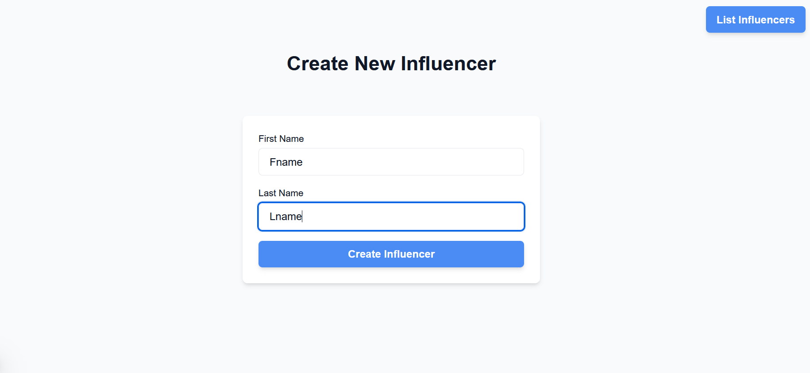
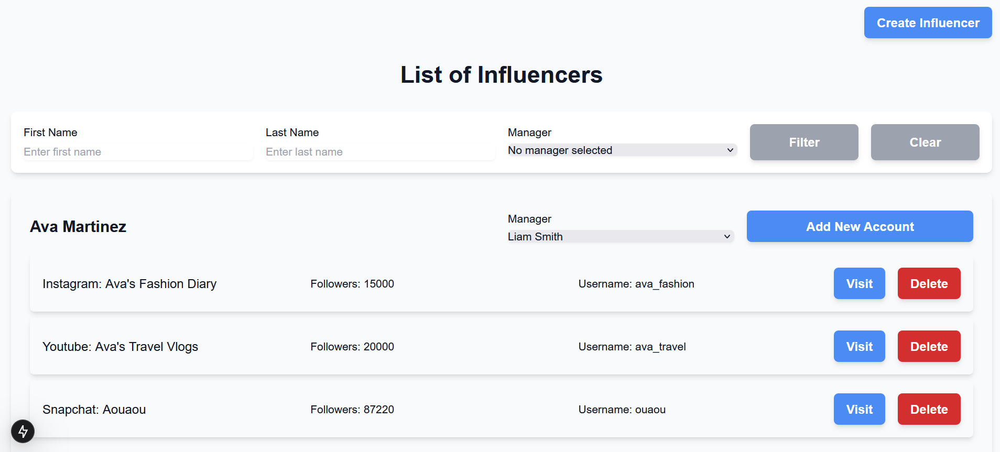
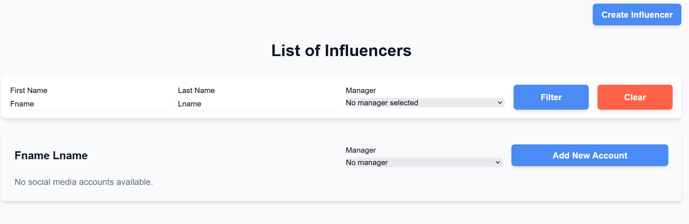
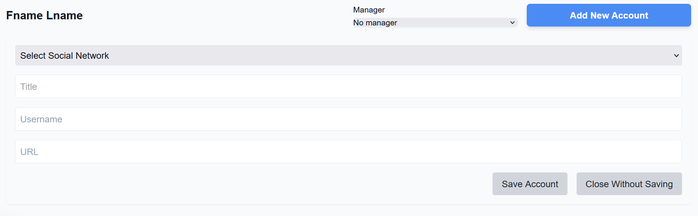

# adSocial Frontend

This is a Next.js app built using TypeScript, Zustand for state management, and Tailwind CSS for styling. It is designed to be responsive, so feel free to view it on phone size.

## Key Features

### Pages

- **Create New Influencer**: A simple page where you can create a new influencer or move to **List of Influencers**.

- **List of Influencers**: This page shows a list of all influencers. You can filter the list by **first name**, **last name**, or **manager**. The filters are executed by pressing the "Filter" button or can be reset with the "Clear" button.

### Workflow

- After creating a new influencer, the system automatically redirects you to the **List of Influencers** page with filters already applied to show the newly created influencer. This eliminates the need for additional pages and keeps the process streamlined.
- Once the influencer is created, you can clear the filters to see all influencers.

### List of Influencers

- The **List of Influencers** page contains a filter bar with three fields: **first name**, **last name**, and **manager**. You can filter the list by entering values into these fields and clicking "Filter" to apply the filter. You can also reset the filters using the "Clear" button.
- Each influencer in the list is displayed with an option to **change the manager** using a dropdown.
- You can **add a new account** for an influencer by revealing a form. The form is only submitted when all fields are filled in.
- You can also **visit the account page** or **delete an account** directly from the list.

## Screenshots

### Create New Influencer

### List of Influencers

### New Influencer Management

### Add Account and Delete Options

## Technical Details

The most interesting part of the code is in the **List of Influencers** page. It contains the `InfluencerElement` component, and inside it is the `AccountElement` component. All the core logic is handled in the `ListInfluencer` component, which passes 11 props to its child components.

I used Zustand context to communicate the newly created influencer's first name and last name from the **Create New Influencer** page to the **List of Influencers** page. This allows me to filter and display the newly created influencer immediately without requiring a page reload.

## Conclusion

This app provides a streamlined experience for managing influencers, including creating, filtering, and managing their social media accounts. It focuses on simplicity and a smooth workflow without unnecessary page transitions.
